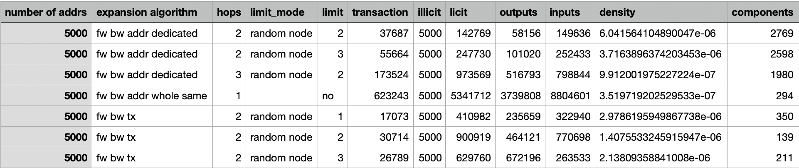
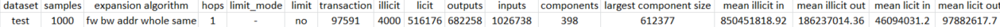

# Dataset Structure

## Graph Type

The directed graph generated from the `.csv` files has the following characteristics:

- **Graph Type:** Heterogeneous, bipartite directed graph with parallel edges but no loops.
- **Heterogeneous Graph Model:**
  - **Nodes:** Two types:
    - **Transaction Nodes:** Represent transactions.
    - **Address Nodes:** Represent blockchain addresses.
  - **Edges:** Represent the flow of coins:
    - **Inputs:** Link address nodes to transaction nodes.
    - **Outputs:** Link transaction nodes to address nodes.

### Edge Properties
- **Direction:** Edges are directed to capture the flow of bitcoins:
  - From an address (input) to a transaction.
  - From a transaction to one or more addresses (output).
- **Weight:** Edges can be weighted, representing the value transferred in bitcoins between nodes.

### Advantages of the Heterogeneous Model
1. **Separation of Node Types and Relationships:**
   - Differentiating transaction nodes from address nodes helps clarify the role of each type within Bitcoin transactions.
   - Differentiated edges between inputs and outputs accurately capture the flow of value.

2. **Coin Flow Modeling:**
   - Directed edges allow tracking the movement of Bitcoins from a source address to one or more destination addresses.

3. **Temporal Context Exploration:**
   - Temporal attributes like `block_height` and `age` provide a temporal perspective of operations, revealing patterns more comprehensively.

## Generated Files

### 1. `addr_feats.csv`
Contains information about the analyzed addresses.

- **Columns:**
  - `addr` (`string`): String representing the blockchain address.
  - `full_type` (`string`): Full type of the address, e.g., P2PKH, P2SH.
  - `class` (`int`): Binary label:
    - `1`: Address classified as malicious.
    - `0`: Address classified as legitimate.

### 2. `tx_feats.csv`
Includes information about transactions related to the addresses.

- **Columns:**
  - `hash` (`string`): Unique hash of the transaction.
  - `block_height` (`int`): Block number where the transaction is included.
  - `fee` (`float`): Fee paid for the transaction (in cryptocurrency units).
  - `is_coinbase` (`int`): Indicates if it is a coinbase transaction (`1`) or not (`0`).
  - `locktime` (`int`): Locktime value of the transaction.
  - `total_size` (`int`): Total size of the transaction (in bytes).
  - `version` (`int`): Transaction format version.

### 3. `input_feats.csv`
Provides detailed information about transaction inputs.

- **Columns:**
  - `addr` (`string` or `None`): Address associated with the input (or `None` if absent).
  - `tx` (`string`): Hash of the originating transaction for the input.
  - `age` (`int`): Age of the coin before being spent (in blocks).
  - `block` (`int`): Block number where the original input was included.
  - `index` (`int`): Index within the set of transaction inputs.
  - `sequence_num` (`int`): Input sequence number.
  - `value` (`float`): Value in Satoshis (sats).

### 4. `output_feats.csv`
Describes transaction outputs, including information about fund distribution.

- **Columns:**
  - `tx` (`string`): Hash of the transaction associated with this output.
  - `addr` (`string` or `None`): Destination address of the output (or `None` if absent).
  - `block` (`int`): Block number where the output is included.
  - `index` (`int`): Index within the set of transaction outputs.
  - `is_spent` (`int`): Indicates if the output has been spent (`1`) or not (`0`).
  - `value` (`float`): Value in Satoshis (sats).

 ## Actual Generated Files

 

 

 

## Relationship Between Files
The CSV files are interconnected to structure blockchain data:
- **Addresses** (`addr_feats.csv`) are associated with **transactions** (`tx_feats.csv`).
- **Transactions** have **inputs** (`input_feats.csv`) and **outputs** (`output_feats.csv`), linking addresses in a directed graph.

# Expansion Algorithm Taxonomy

In this part, we provide an overview of different algorithms used to expand address or transaction networks in blockchain analysis. The explanations focus on how each algorithm operates, explaining its specific approach and the relationships it explores.

The results of expanding the address 1C9KA8hWUuASCdDq1EPB7PmcnFNqhb1so2 over 2 hops are shown also. The green nodes represent licit addresses, the largest red node represents the illicit node, and the gray nodes are transactions between addresses. The direction of the edges indicates the flow of funds ((addr -> tx) is an input, (tx -> addr) is an output), and the layout of the graph shows past transactions at the top moving to future transactions at the bottom. 

## Transaction-Based Expansion
This approach focuses on exploring the network of transactions by tracking the flow of bitcoins through inputs and outputs. It identifies related transactions, emphasizing the movement of funds rather than the specific addresses involved.

### Forward-Backward Expansion
The forward-backward algorithm separates the exploration into two distinct phases:

- **Forward Expansion**: Captures the flow of bitcoins by identifying future transactions that spend the outputs of the current transactions, following the "spending path."
- **Backward Expansion**: Searches for the origins of bitcoins by exploring transactions that created the inputs of the current transactions, reconstructing the "funding path."

This approach provides flexibility, allowing to focus on specific aspects such as origins, destinations, or complete spending paths.

### All-Over Expansion
Starting with an initial set of addresses and their transactions, this approach explores connections between nodes through both inputs and outputs. Each hop identifies new transactions linked to the current set, both by their inputs (funding transactions) and outputs (spending transactions).

### Comparison: Forward-Backward vs. All-Over
In contrast to the all-over method, the forward-backward approach separates exploration into forward and backward phases. This enables specifying the number of hops in each direction, facilitating targeted analyses. The all-over algorithm, by contrast, combines forward and backward exploration within each hop, simultaneously exploring funding and spending relationships of every address in the current set.

## Address-Based Expansion
This method centers on the network of addresses, rather than transactions. It explores relationships between addresses by tracing the transactions they participate in. Unlike transaction-based expansion, this approach emphasizes the connections and roles of individual addresses in the network.

### Dedicated Inputs/Outputs
A forward-backward expansion algorithm centered on addresses, this approach:

- **Forward Phase**: Explores outgoing relationships, identifying transactions funded by the current addresses and new addresses from transaction outputs.
- **Backward Phase**: Explores incoming relationships, identifying transactions that fund the current addresses and tracing inputs to their original addresses.

This method avoids rapid graph expansion by ignoring "side" addresses (inputs in the forward phase and outputs in the backward phase that do not correspond to the expanding addresses).

### Whole Transaction Implied Addresses
This approach also performs iterative forward and backward phases but includes all inputs and outputs associated with each transaction explored. Variants of this method handle "side" addresses differently:

- **None**: Side addresses remain as leaf nodes and are not included in further expansions.

- **Same**: Side addresses are expanded in the direction corresponding to their role (e.g., future for forward, past for backward).

- **Opposite**: Side addresses are expanded in the reverse direction of their role (e.g., past for forward, future for backward).

### All-Over
In each hop, it examines both inputs and outputs of transactions involving the current set of addresses, identifying new related addresses and adding them to the expanding graph. This results in a broader and more interconnected graph

